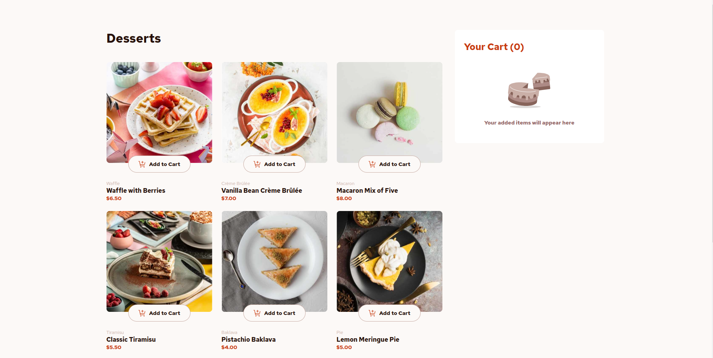

# Frontend Mentor - Product list with cart solution

This is a solution to the [Product list with cart challenge on Frontend Mentor](https://www.frontendmentor.io/challenges/product-list-with-cart-5MmqLVAp_d). Frontend Mentor challenges help you improve your coding skills by building realistic projects. 

## Table of contents

- [Overview](#overview)
  - [The challenge](#the-challenge)
  - [Screenshot](#screenshot)
  - [Links](#links)
- [My process](#my-process)
  - [Built with](#built-with)
  - [Useful resources](#useful-resources)
- [Author](#author)

**Note: Delete this note and update the table of contents based on what sections you keep.**

## Overview

### The challenge

Users should be able to:


- Add items to the cart and remove them
- Increase/decrease the number of items in the cart
- See an order confirmation modal when they click "Confirm Order"
- Reset their selections when they click "Start New Order"
- View the optimal layout for the interface depending on their device's screen size
- See hover and focus states for all interactive elements on the page

### Screenshot




### Links

- Solution URL (GitHub Repo): [https://github.com/Paloma-Cruz/project-mtd](https://github.com/Paloma-Cruz/project-mtd)
- Live Site URL (GitHub Pages): [https://paloma-cruz.github.io/project-mtd/](https://paloma-cruz.github.io/project-mtd/)

## My process

### Built with

- Semantic HTML5 markup
- SASS
- Flexbox
- CSS Grid
- [React](https://reactjs.org/) - JS library
- [Styled Components](https://styled-components.com/) - For styles
- [Vite](https://vitejs.dev/) - Front-end Tool

### Useful resources

- Start Project: 
  ```bash
  npm run dev
  ```
  
- Build Project: 
  ```bash
  npm run build
  ```

- Run Build: 
  ```bash
  npm install -g server
  server -s dist
  ```

## Author

Paloma da Cruz
- LinkedIn - [linkedin.com/in/paloma-da-cruz](https://www.linkedin.com/in/paloma-da-cruz/)
- Email - [palomacruzperes@hotmail.com](mailto:palomacruzperes@hotmail.com)
- Telefone - [Ligar para +351 937821016](tel:+351937821016)
